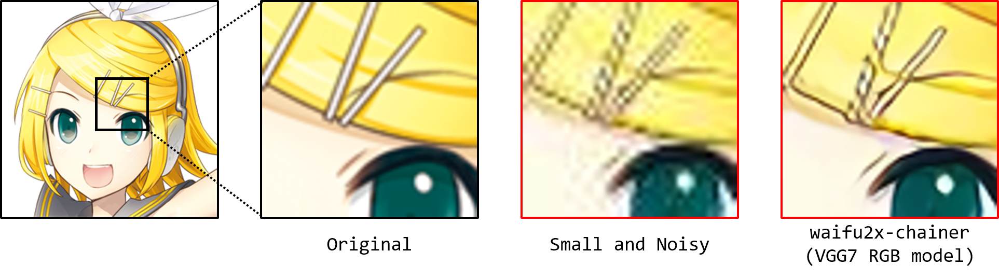

# waifu2x-chainer

This repository contains the Chainer implementation of waifu2x [[1]](https://github.com/nagadomi/waifu2x).
Note that the training procedure of waifu2x-chainer may be slightly different from original waifu2x.

## Summary



- 2D character picture (Kagamine Rin) is licensed under CC BY-NC by piapro [2].

## Requirements

  - Chainer
  - CuPy (for GPU support)
  - Matplotlib (for benchmark)
  - ONNX-Chainer (for ONNX model export)
  - Pillow
  - Wand (for training)

## Installation

### Install Python packages
```
pip install chainer
pip install pillow
```

### Enable GPU support

Install CuPy precompiled binary package which includes the latest version of cuDNN library.  
See: [CuPy Installation Guide](https://docs-cupy.chainer.org/en/stable/install.html#install-cupy)

### Getting waifu2x-chainer
```
git clone https://github.com/tsurumeso/waifu2x-chainer.git
```

### Testing
```
cd waifu2x-chainer
python waifu2x.py
```

## Usage

Omitting --gpu (-g) option run on CPU.

### Noise reduction
```
python waifu2x.py --method noise --noise_level 1 --input path/to/image/or/directory --arch VGG7 --gpu 0

python waifu2x.py -m noise -n 0 -i path/to/image/or/directory -a 0 -g 0
python waifu2x.py -m noise -n 2 -i path/to/image/or/directory -a 0 -g 0
python waifu2x.py -m noise -n 3 -i path/to/image/or/directory -a 0 -g 0
```

### 2x upscaling
```
python waifu2x.py --method scale --input path/to/image/or/directory --arch VGG7 --gpu 0

python waifu2x.py -m scale -i path/to/image/or/directory -a 0 -g 0
```

### Noise reduction + 2x upscaling
```
python waifu2x.py --method noise_scale --noise_level 1 --input path/to/image/or/directory --arch VGG7 --gpu 0

python waifu2x.py -m noise_scale -n 0 -i path/to/image/or/directory -a 0 -g 0
python waifu2x.py -m noise_scale -n 2 -i path/to/image/or/directory -a 0 -g 0
python waifu2x.py -m noise_scale -n 3 -i path/to/image/or/directory -a 0 -g 0
```

## Train your own model

### Install Wand
```
sudo apt install libmagickwand-dev
pip install wand
```

For more details, please refer template training script at
<a href="https://github.com/tsurumeso/waifu2x-chainer/tree/master/appendix/linux">appendix/linux</a>
or
<a href="https://github.com/tsurumeso/waifu2x-chainer/tree/master/appendix/windows">appendix/windows</a>
. In my case, 5000 JPEG images are used for pretraining and 1000 noise-free-PNG images for finetuning.

## Convert Chainer models to ONNX and Caffe models

### Install ONNX-Chainer
```
pip install onnx-chainer
```

### Run script
```
cd appendix
python convert_models.py
```

Results are saved at the same directory of the original models
(e.g. models/vgg7/anime_style_scale_rgb.npz to models/vgg7/anime_style_scale_rgb.caffemodel).  
Note: Since `chainer.CaffeFunction` does not currently support `Slice` layer, some models skip conversion to caffemodel.

## References

- [1] nagadomi, "Image Super-Resolution for Anime-Style Art", https://github.com/nagadomi/waifu2x
- [2] "For Creators", http://piapro.net/en_for_creators.html
